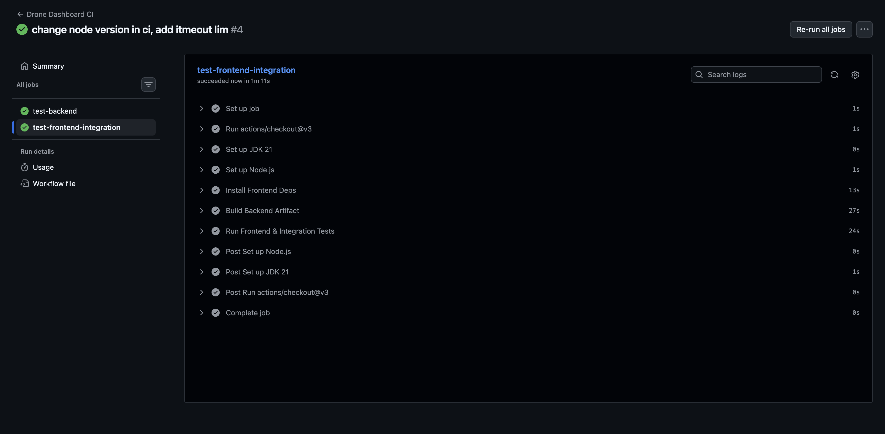
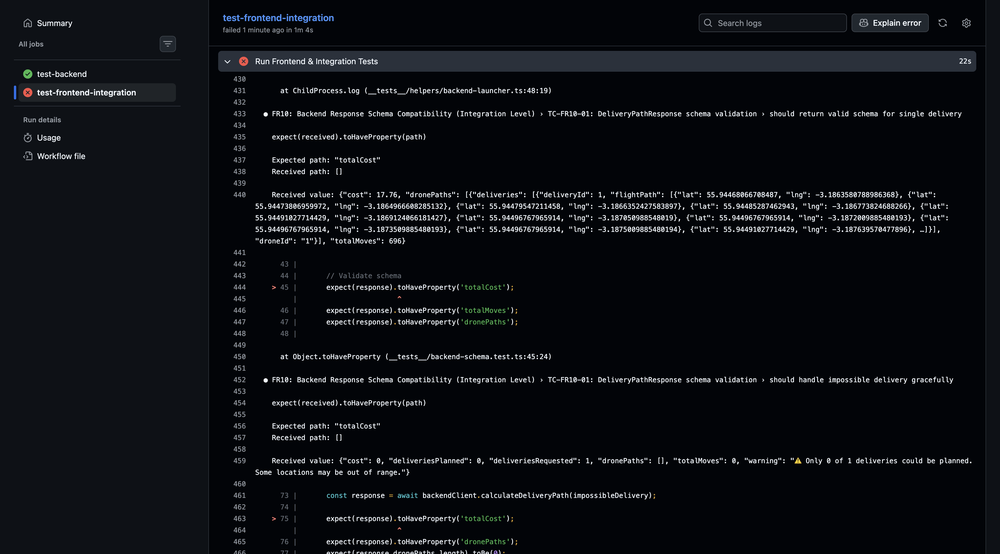

# Review and CI/CD Report

## 1. Code Review Strategy (LO 5.1)

### Review Checklist
I designed a specific checklist for Self-Review prior to committing code, targeting the specific risks identified in the Test Plan (Cost Accuracy & API Security).

**General Criteria:**
- [ ] **Readability:** Variables use domain terms (e.g., `costPerMove`, not `cpm`).
- [ ] **Tests:** Every new feature includes at least one positive and one negative test case.
- [ ] **Security:** No secrets committed (checked via `git diff`).

**Specific Criteria (Risk-Based):**
- [ ] **Floating Point Math:** Any currency calculation must use `BigDecimal` or documented rounding logic.
- [ ] **API Contracts:** Any change to a Java DTO must have a corresponding change in the TypeScript Interface.
- [ ] **Defensive Coding:** Parsers must handle `null` or malformed inputs without crashing the thread.

### Sample Self-Review Outcome
**Artifact:** `feature/cost-precision` branch.
**Issue Identified:** Original implementation used `double` accumulation for path costs.
**Finding:** *"This implementation accumulates rounding errors on long paths (e.g., £10.00000004). Must switch to BigDecimal or enforce rounding at the service boundary."*
**Resolution:** Refactored to use `Math.round()` on final output before DTO mapping.

---

## 2. CI Pipeline Design (LO 5.2 & 5.3)

The pipeline is implemented using **GitHub Actions** (see `.github/workflows/ci.yml`). It is triggered on `push` to `main` and all `pull_request` events.

### Pipeline Stages
1.  **Build & Unit Test (Parallel):**
    *   **Backend:** Runs `mvn test` (JUnit).
    *   **Frontend:** Runs `npm test` (Jest) for isolated logic.
2.  **Integration Test (Blocking):**
    *   Launches Spring Boot Backend in the CI runner.
    *   Waits for Health Check (`/api/v1/health`).
    *   Executes `backend-schema.test.ts` against the live local server.
3.  **Security Gate (Blocking):**
    *   Runs `security.test.ts` (Static Analysis).
    *   Scans for `sk-ant-` key patterns in build artifacts.
4.  **Report Generation:**
    *   Uploads Coverage Reports (JaCoCo + Istanbul) as artifacts.

---

## 3. Pipeline Demonstration (LO 5.4)

### Scenario A: The "Happy Path"
**Input:** `main` branch (Clean build).
**Result:** All jobs pass. The Integration Tests successfully spawned the backend and verified the API contract.

*Figure 1: Successful execution of parallel unit tests and the blocking integration stage.*

### Scenario B: The "Broken Contract" (Interface Fault)
**Input:** Branch `feature/break-contract`.
**Modification:** Used `@JsonProperty("cost")` in the Java DTO to rename the JSON output field, but deliberately did not update the Frontend TypeScript interface (which expects `totalCost`).

**Pipeline Behavior:**
1.  **`test-backend` (Unit Tests):** **PASS**. (Internal Java logic is valid and compiles).
2.  **`test-frontend-integration`:** **FAIL**. (The harness detected the schema mismatch).

*Figure 2: The pipeline correctly catching an Interface Fault. Note that the Backend Unit Tests  passed, proving that Unit Testing alone is insufficient for catching integration errors.*

**Analysis:** This demonstrates that the CI pipeline functions as an automated regression guard (Y&P Ch22), trapping integration defects that would otherwise crash the production UI.