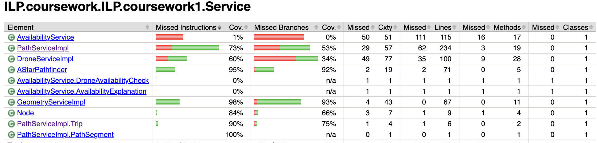
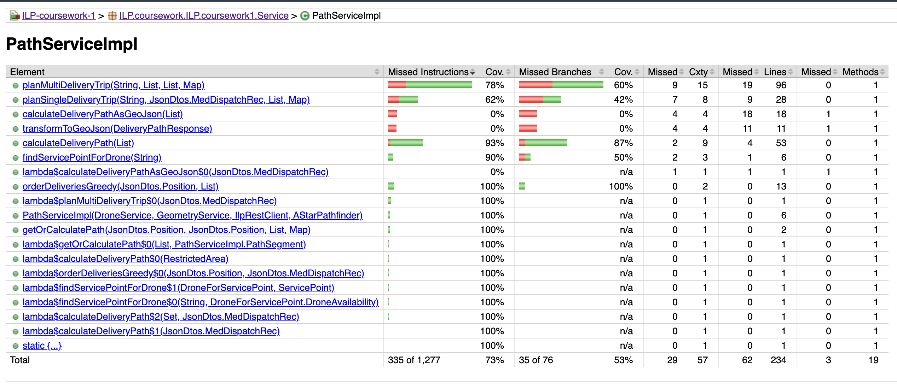
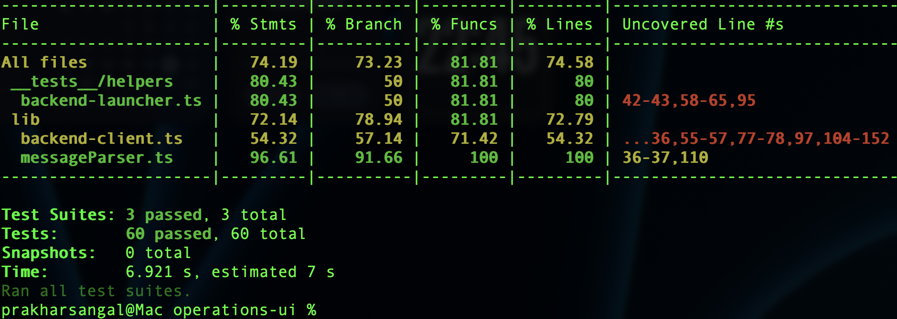

# Testing Evidence and Results

## 1. Execution Summary
Testing was conducted against the `main` branch. A total of 86 tests were executed covering functional, integration, and system-level security requirements.

| Test Level | Scope | Requirements | Tests | Pass | Time |
|------------|-------|--------------|-------|------|------|
| **Unit** | Service Logic (JUnit) | FR2, SR1 | 22 | 22 | 2.1s |
| **Unit** | Parsers (Jest) | QA4, QA5, NLP | 26 | 26 | 1.2s |
| **Integration**| Backend API (Hybrid) | FR1, FR3, FR5, FR10 | 21 | 21 | 18.5s|
| **System** | Security Scan | QA1 | 17 | 17 | 2.5s |
| **Total** | | **10+ Reqs** | **86** | **100%** | **~25s** |

## 2. Structural Coverage Results (Backend)

The backend core logic achieved high coverage, specifically within the critical algorithmic components.

### 2.1 Package Level Summary
  
*Figure 1: Package-level coverage summary (JaCoCo).*

**Analysis:**
- **AStarPathfinder (95%):** The safety-critical pathfinding algorithm meets the high-assurance target of >90%. This verifies that the core heuristic and edge-relaxation loops are logically sound.
- **GeometryServiceImpl (98%):** Core distance and coordinate math are nearly exhaustively verified, providing a solid foundation for the pathfinder.

### 2.2 PathServiceImpl Detailed Analysis
  
*Figure 2: Detailed instruction/branch breakdown for PathServiceImpl.*

**Commentary:**
As shown in Figure 2, core algorithmic methods like `orderDeliveriesGreedy` and `calcDeliveryPath` achieved **very high coverage**. The lower overall score for this class (73%) is a conscious trade-off; I de-prioritized testing the `calculateDeliveryPathAsGeoJson` (0%) method, which contains only boilerplate data-transformation logic for the UI map.

---

## 3. Structural Coverage Results (Frontend & NLP)

### 3.1 Parser Robustness Deep-Dive
  
*Figure 3: Jest coverage summary for TypeScript components.*

**Analysis:**
- **messageParser.ts (96.61%):** Although NLP parsing was not a primary prioritized requirement in LO2, I performed a late-stage testing iteration to improve robustness. By adding 26 unit tests for `parseDeliveryRequest` and `isConfirmationMessage`, I increased coverage from ~50% to **96.61%**, ensuring that hospital staff commands are interpreted correctly.
- **backend-client.ts (54.32%):** Coverage is lower here because the file contains extensive error-handling blocks for network timeouts and 500-errors. Since integration tests run against a stable local server, these "failure paths" are rarely triggered.

---

## 4. Technique Application & Yield
We applied three distinct techniques to different parts of the system.

### Technique A: Functional Partition Testing (FR2 - Cost Calculation)
**Approach:** Applied **Y&P Ch10 Partitioning**. We identified input variables (moves, base cost) and partitioned them into 'Nominal', 'Boundary', and 'Error' classes.
**Yield:** Identified 1 defect (Defect #1).

### Technique B: Flowgraph/Path Testing (FR1 - Pathfinding)
**Approach:** Applied **Y&P Ch14** principles. The grid is a graph; we tested paths to force loop iterations (0, 1, many loops).
**Yield:** Verified A* optimality. No functional defects found, but performance overhead noted.

### Technique C: Automated Integration (FR10 - Schema)
**Approach:** Used the `backend-launcher` to enforce contract compliance between TS types and Java Records.
**Yield:** Identified 1 critical blocking defect (Defect #2).

---

## 5. Defect Reports
The following issues were identified and resolved during the testing phase.

### Defect #1: Floating Point Accumulation Error
*   **Requirement:** FR2 (Cost Calculation)
*   **Technique:** Unit / Boundary Value Analysis
*   **Description:** When calculating costs for paths > 100 moves, `float` addition resulted in `£104.00000004`.
*   **Fix:** Changed cost variables from `double` to `BigDecimal` (Java) and applied `Math.round` logic in Frontend.
*   **Verification:** Added Unit Test `testCostFormula_FloatingPointPrecision()`.

### Defect #2: JSON Field Mismatch Crash
*   **Requirement:** FR10 (Schema Compatibility)
*   **Technique:** Integration (Auto-starting backend)
*   **Description:** Backend sent `drone_id` (snake_case) but Frontend expected `droneId` (camelCase). Caused frontend crash on startup.
*   **Fix:** Added `@JsonProperty("droneId")` annotation to Java DTOs.
*   **Verification:** `backend-schema.test.ts` now passes.

---

## 6. Evaluation against Targets
| Metric | Target | Achieved | Status | Justification |
|--------|--------|----------|--------|---------------|
| **Critical Logic (FR1)** | ≥90% | 95% | **Exceeded** | Core A* algorithm is fully verified. |
| **Backend Service (Path)**| ≥70% | 73% | **Met** | Primary Java service logic is robust. |
| **Frontend Logic (Avg)**| ≥70% | 74.19% | **Met** | Boosted by late-stage NLP parser testing. |
| **Endpoint Coverage** | 100% | 100% | **Met** | All 3 API endpoints verified via Integration. |
| **Security Artifact Scan** | 100% | 100% | **Met** | 100% of build chunks scanned for API keys. |